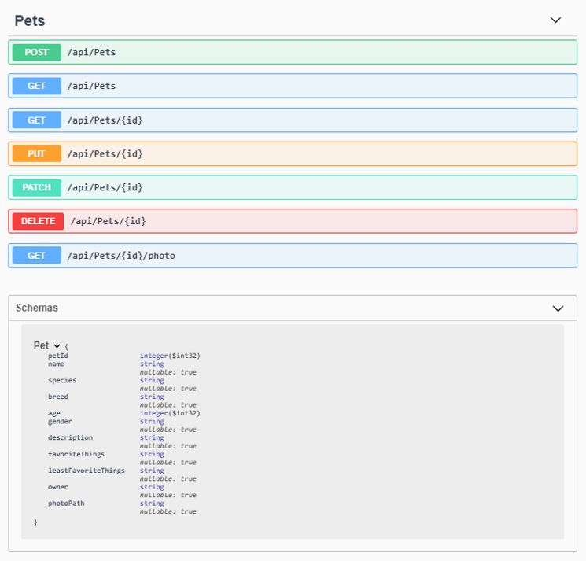

# Epicodus Pets API

#### _An API for awesome pets, 29 Oct 2019_

#### By _**Jacqueline Remmel and Jason Huels**_

## Description

The purpose of this project was to practice building an API that provides information about the adorable pets of the 2019-2020 Epicodus C# cohort.

## Setup/Installation Requirements

* _Clone this repository_
* _Navigate to the main directory, "epicodus-pets-api"_
* _Navigate to the API project directory, "Pets"_
* _Run the command "dotnet restore"_
* _Run the command "dotnet ef database update"_
* _Run the command "dotnet watch run"_
* _To visit Swagger documentation, go to the URL "http://localhost:5000/swagger/" in a browser_

 

## Technologies Used

_C# .NET, MySQL, Entity, Swashbuckle/Swagger_

### License

*Open-source*

Copyright (c) 2019 **_Jacqueline Remmel and Jason Huels_**